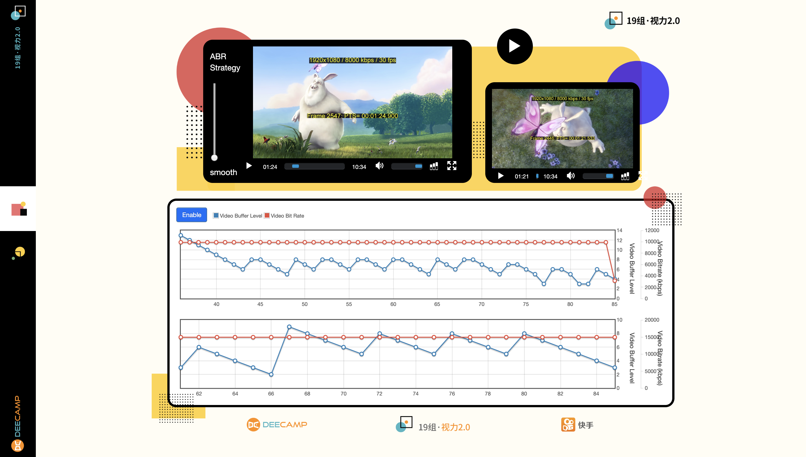
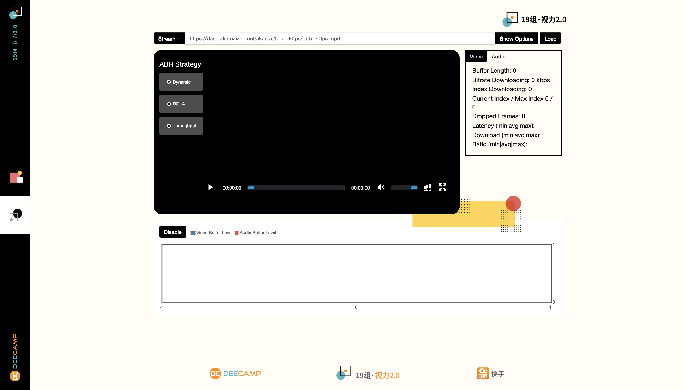
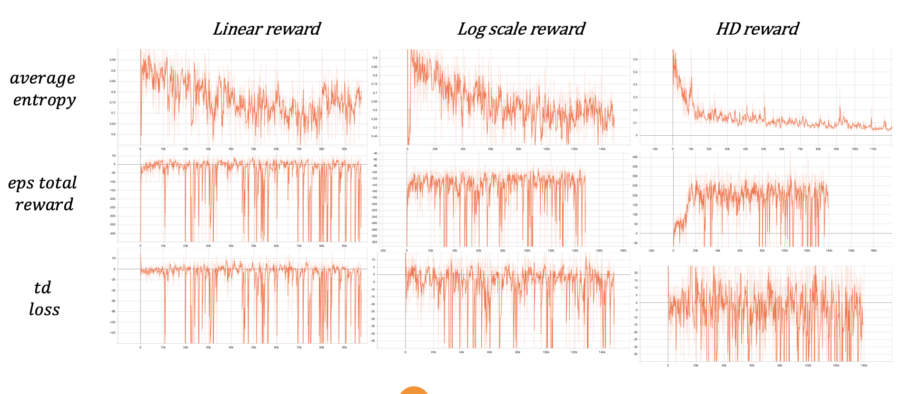

# Quality-aware Media Streaming Optimization (based on [Pensieve](https://github.com/hongzimao/pensieve))[[slide](slide/final.pptx)]

## Table of Contents
- [Quality-aware Media Streaming Optimization (based on Pensieve)[slide]](#quality-aware-media-streaming-optimization-based-on-pensieveslide)
	- [Table of Contents](#table-of-contents)
	- [Objectives](#objectives)
	- [Setup](#setup)
	- [Apache Server](#apache-server)
		- [Linux](#linux)
			- [Installation & Basic Setup](#installation--basic-setup)
			- [Change Port Number](#change-port-number)
		- [Windows](#windows)
			- [Installation & Basic Setup](#installation--basic-setup-1)
		- [Mac](#mac)
			- [Installation & Basic Setup](#installation--basic-setup-2)
			- [Change Port Number](#change-port-number-1)
	- [Chromedriver & Selenium](#chromedriver--selenium)
	- [Addition of 9-level quality video](#addition-of-9-level-quality-video)
	- [Version Changes compared to original pensieve](#version-changes-compared-to-original-pensieve)
	- [Additional changes compared to original pensieve (especially on frontend)](#additional-changes-compared-to-original-pensieve-especially-on-frontend)
	- [Real-world experiments](#real-world-experiments)
	- [Training Results](#training-results)
	- [Future Work](#future-work)
	- [Dependency](#dependency)
- [Reference](#reference)

## Objectives 
-  Recreate the [real-world experiments](https://github.com/hongzimao/pensieve#real-world-experiments) 
-  Customize the adaptation algorithms for different needs (smooth, balanced, high-quality)
-  Optimize the current ABR algorithm (based on RL) so that it could be applied in HLS (HTTP Live Streaming) (desired ABR algorithm could enable the video to have smooth playback while retaining a much smaller buffer level than playback environment)
- Gather a much larger dataset ([FCC](https://www.fcc.gov/reports-research/reports/measuring-broadband-america), [Belgium](http://users.ugent.be/~jvdrhoof/dataset-4g/logs/logs_all.zip), [Oboe](https://github.com/USC-NSL/Oboe), [Waterloo Streaming QoE Dataset](https://ece.uwaterloo.ca/~zduanmu/jstsp16qoe/))

## Setup

## Apache Server

### Linux

#### Installation & Basic Setup
- update package local index
```
sudo apt update
```
- install apache2 
```
sudo apt install apache2
```
- start server
```
sudo service start apache2
```
- test that the server is working properly by entering `localhost:80` in the browser and it should show the [apache default webpage](http://server.ispa.cnr.it/).

#### Change Port Number
- use [vim](https://www.vim.org/) to open `ports.conf`
```
vim /etc/apache2/ports.conf
```
- Change `Listen 80` to `Listen [port number]`
- restart the server
```
sudo service restart apache2
```
- test that the server is working properly by entering `localhost:[port number]` in the browser and it should show the [apache default webpage](http://server.ispa.cnr.it/).


### Windows

#### Installation & Basic Setup
- download [Apache Lounge](http://www.apachelounge.com/download/)
- download [Apache Haus](https://www.apachehaus.com/cgi-bin/download.plx) and unzip the file under specific disk location
- more details can be viewed in [`windows-pensieve/`](windows-pensieve/)

### Mac

#### Installation & Basic Setup
- stop running (older) Apache server and remove it
```
sudo apachectl stop
sudo launchctl unload -w /System/Library/LaunchDaemons/org.apache.httpd.plist
```
- install [httpd](https://httpd.apache.org/) via [Homebrew](https://brew.sh/) 
```
brew install httpd
```
- start server 
```
sudo brew services start httpd
```
- test that the server is working properly by entering `localhost:8080` in the browser and it should show the [apache default webpage](http://server.ispa.cnr.it/).

#### Change Port Number
- use [vim](https://www.vim.org/) to open `httpd.conf`
```
vim /etc/apache2/httpd.conf
```
- change `Listen 8080` to `Listen [port number]`
- test that the server is working properly by entering `localhost:[port number]` in the browser and it should show the [apache default webpage](http://server.ispa.cnr.it/).

## Chromedriver & Selenium

- Detailed steps are provided in [`setup.py`](https://github.com/hongzimao/pensieve/blob/master/setup.py#L14)
- **make sure that [Google Chrome](https://www.google.com/chrome/) is already installed before doing the following installation and setup.**
- check Google Chrome [version](chrome://version)
- download corresponding [chromedriver](http://chromedriver.storage.googleapis.com/index.html) and put it under `abr_browser_dir/`

## Addition of 9-level quality video
In addition to 6-level quality video already provided under `video_server`, we have added the other 9-level quality video. The manifest can be downloaded here
```
https://dash.akamaized.net/akamai/bbb_30fps/bbb_30fps.mpd
```
and video segments can be downloaded here
```
https://dash.akamaized.net/akamai/bbb_30fps/bbb_30fps.zip
```

The following table shows corresponding changes.
|Item Description|6-level Quality Video File Name|9-level Quality Video File Name|
|--|--|--|
|get video sizes|[`sim/get_video_sizes.py`](sim/get_video_sizes.py)|[`sim/get_video_sizes_bbb_30fps.py`](sim/get_video_sizes_bbb_30fps.py)|
|video sizes|`sim/video_size_[index]` (index ranges from 0 to 5)|`sim/video_size_bbb_30fps_[index]` (index ranges from 0 to 9)|
|simulation folder|[`sim`](sim/)|[`sim_bbb_30fps`](sim_bbb_30fps/)|
|server folder|[`rl_server/`](rl_server/)|[`rl_server_bbb_30fps/`](rl_server_bbb_30fps)|

## Version Changes compared to original pensieve
- As pensieve is originally written in [Python 2.7](https://www.python.org/download/releases/2.7.2/), the following changes are mainly migrations to [Python 3.7](https://www.python.org/downloads/release/python-373/).  
  - add parantheses around `print` statements
  - all the `open` commands are changed from `wb` (or `rb`) to `w` (or `r`)
- Under [`rl_server/`](rl_server/) and [`rl_server_bbb_30fps/`](rl_server_bbb_30fps/), programs used to build backend server for transfer of state information include
 
|File Name|Supported Algorithm|
|--|--|
|[`dash_server_original.py`](rl_server_bbb_30fps/dash_server_original.py)||
|[`mpc_server.py`](rl_server_bbb_30fps/mpc_server.py)|MPC|
|[`robust_mpc_server.py`](rl_server_bbb_30fps/robust_mpc_server.py)|robustMPC|
|[`rl_server_no_training.py`](rl_server_bbb_30fps/rl_server_no_training.py)|A3C (RL)|
|[`simple_server.py`](rl_server_bbb_30fps/simple_server.py)||

  - The following changes should be applied in all files above

  |Location|Original|Current|
  |--|--|--|
  |first two lines|<code>from BaseHTTPServer import BaseHTTPRequestHandler, HTTPServer<br>import SocketServer</code>|<code>from http.server import BaseHTTPRequestHandler, HTTPServer<br>import socketserver</code>|
  |`server_address`|`('localhost', port)`|`('', port)`|
  |`self.wfile.write`|`[string]`|`[srting].encode()`|

## Additional changes compared to original pensieve (especially on frontend)
- In order to adapt to various needs of users (smooth, high-quality, balanced), we add a [vertical slider](https://stackoverflow.com/a/15935838/7581279) that can change 3 different reward schemes in-time. 
- we refurbished the frontend for comparison between RL algorithms and traditional algorithms. Below are the screenshots.

  

  

- As we need to simultaneously play two videos, we need to start two servers for file transfer. Therefore, we need to change port number. In this case, we used `BOLA` for comparison, and hence we change [`simple_server`](rl_server/simple_server.py#L99) to port `8334` and change the port number in [`dash.all.min.js`]() correspondingly.
- **Caution**: it is preferred (and a better practice) that JavaScript changes should be first made in original source files and then use `grunt dist` to update `dash.all.min.js`. But for simplicity and convenience, we have directly updated the changes in `dash.all.min.js`.

## Real-world experiments 
- set up the [server](#apache-server) 
- copy web application files to Apache Server Document Root folder
```
cp -r dash.js/ /usr/local/var/www/
```
- restart server
```
sudo brew services start httpd
```
- run RL server
```
python rl_server_bbb_30fps/rl_server_no_training.py
```
- run simple server
```
python rl_server_bbb_30fps/simple_sever.py
```
- launch reference client by `localhost:[port number]/dash.js/samples/dash-if-reference-player/deecamp.html`

## Training Results
- The following are training results from original pensieve.



All of 3 reward schemes show very high instability, and this is partially reflected in the frequent changes of bitrates by the video client.

## Future Work
- As described in [Training Results](#training-results), the training curves oscillate significantly. Therefore, [this issue](https://github.com/hongzimao/pensieve/issues/76) suggests variance reduction, detailed in [Variance Reduction for Reinforcement Learning in Input-Driven Environments](https://openreview.net/forum?id=Hyg1G2AqtQ).
- Create a model ensemble consisting of other RL models, including [PPO](https://github.com/godka/Pensieve-PPO2), VPG, [DQN](https://github.com/godka/ABR-DQN) and DQN-based framework [D-DASH](https://ieeexplore.ieee.org/abstract/document/8048013). 

## Dependency
- Python 3.7
- Tensorflow 1.9

# Reference 
- pensieve: https://github.com/hongzimao/pensieve/
- Ubuntu Apache Setup: https://www.digitalocean.com/community/tutorials/how-to-install-the-apache-web-server-on-ubuntu-18-04-quickstart
- Mac Apache Setup: https://tecadmin.net/install-apache-macos-homebrew/
- Windows Apache Setup (zh-CN)
  - Installation & Setup of VC14 and Apache Lounge: https://blog.csdn.net/liyang4534/article/details/78036591
  - Installation & Setup of Apache Haus: https://blog.csdn.net/weixin_43738701/article/details/86607148
- Installation & Setup of Chomedriver and Selenium on Windows: https://blog.csdn.net/Booboochen/article/details/80531155